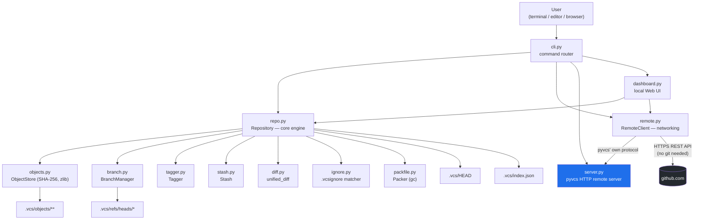

# pyvcs — Complete Documentation

`pyvcs` is a fully **independent version control system** — Git-inspired in concept, but a completely original implementation. It has its own commit object model, its own staging area, its own branch/merge/tag/stash engine, and to push to GitHub it makes direct HTTP calls to GitHub's REST API. The `git` binary is never involved at any step.

---

## Table of Contents

1. [Architecture](#1-architecture)
2. [Installation & Running](#2-installation--running)
3. [Renaming the Command (vcs → something else)](#3-renaming-the-command-vcs--something-else)
4. [Full Command Reference](#4-full-command-reference)
5. [Pushing to GitHub (without Git)](#5-pushing-to-github-without-git)
6. [GitHub Token Setup (Windows PowerShell)](#6-github-token-setup-windows-powershell)
7. [Rolling This Out to Your Organization](#7-rolling-this-out-to-your-organization)
8. [Adding a New Command](#8-adding-a-new-command)
9. [Web Dashboard](#9-web-dashboard)
10. [Code Editor (VS Code) Integration](#10-code-editor-vs-code-integration)
11. [Troubleshooting & Limitations](#11-troubleshooting--limitations)

---

## 1. Architecture



**Layer breakdown:**

| Layer | File(s) | Responsibility |
|---|---|---|
| CLI Router | `cli.py` | Parses `vcs <command>` and calls the right function |
| Core Engine | `repo.py` | Staging, commit, status, log, diff, blame, revert, gc |
| Object Store | `objects.py` | Turns every file/tree/commit into a content-addressed object (SHA-256), zlib-compressed, stored in `.vcs/objects/` |
| Branching | `branch.py` | Create / switch / delete / merge (fast-forward + 3-way) |
| Tags | `tagger.py` | Named pointers to commits |
| Stash | `stash.py` | Shelving uncommitted changes |
| Ignore rules | `ignore.py` | Reads `.vcsignore` |
| Packfile / GC | `packfile.py` | Compacts loose objects |
| Networking | `remote.py` | Pushes to either the pyvcs server or directly to GitHub (REST API) |
| pyvcs Server | `server.py` | Your own lightweight remote-hosting server |
| Dashboard | `dashboard.py` | Browser-based UI |

Built entirely on the Python standard library — no external `pip install` required.

---

## 2. Installation & Running

No external packages required (Python 3.8+ is all you need). This folder also ships with a one-click installer, so anyone — on any computer, anywhere — can install `vcs` without manually editing paths or writing an alias themselves.

### Easiest way — one-click installer

**Windows**: double-click `install.bat` inside the `vcs` folder (or run it from a terminal).
**macOS / Linux**: from a terminal:
```bash
cd path/to/pyvcs/vcs
bash install.sh
```

Both installers **detect their own folder's location automatically** — so no matter where the folder is placed (Desktop, a different drive, a USB stick, a totally different computer), the installer wires up the `vcs` command correctly. After installing, open a **new terminal window** and just run:
```bash
vcs init
vcs stage .
vcs save -m "first commit"
```

> These installer scripts will work identically on someone else's computer — there's no hardcoded username or path inside them.

### Manual way (without the installer)

```bash
# Go to your project folder
cd path/to/your-project

# Run init, pointing at the pyvcs source
python3 path/to/pyvcs/vcs/cli.py init .
```

To avoid typing the full path every time, create an alias:

**Linux / macOS** (`~/.bashrc` or `~/.zshrc`):
```bash
alias vcs="python3 ~/pyvcs/vcs/cli.py"
```

**Windows (PowerShell profile)**:
```powershell
function vcs { python "$HOME\pyvcs\vcs\cli.py" @args }
```

Then simply:
```bash
vcs init
vcs stage .
vcs save -m "first commit"
vcs log
```

---

## 3. Renaming the Command (`vcs` → something else)

`vcs` isn't hardcoded anywhere — it's just the name of the alias/function you pointed at `cli.py`. Renaming it is simple; you don't need to touch `cli.py` itself at all.

### Linux / macOS
```bash
# e.g. you want "mytool" instead of "vcs"
alias mytool="python3 ~/pyvcs/vcs/cli.py"
```
Now `mytool init`, `mytool stage .`, etc. will work.

### Windows PowerShell
```powershell
function mytool { python "$HOME\pyvcs\vcs\cli.py" @args }
```

### A permanent, shareable wrapper (batch file) — Windows
If you want your whole team to use the same command name without each person editing their own profile, create a `.bat` file:

`mytool.bat` (place it anywhere, e.g. `C:\Tools\pyvcs\mytool.bat`):
```bat
@echo off
python "C:\Tools\pyvcs\vcs\cli.py" %*
```
Then add that folder (`C:\Tools\pyvcs\`) to the system `PATH` (via Environment Variables settings) — now `mytool` will work from any terminal, without anyone needing to set an alias.

### Linux / macOS equivalent (shell script)
`/usr/local/bin/mytool`:
```bash
#!/bin/bash
python3 /opt/pyvcs/vcs/cli.py "$@"
```
```bash
chmod +x /usr/local/bin/mytool
```
`/usr/local/bin` is already on the PATH, so `mytool` will just work.

---

## 4. Full Command Reference

| Command | What it does |
|---|---|
| `vcs init [dir]` | Creates a new repository — `.vcs/` folder plus a default `.vcsignore` |
| `vcs stage <file\|dir\|.>` | Adds file(s) to the staging area |
| `vcs unstage <file>` | Removes from staging |
| `vcs save -m "msg"` | Creates a commit (snapshot) from staged files |
| `vcs status` | Shows staged / modified / untracked files |
| `vcs log` | Commit history |
| `vcs show <commit\|tag>` | Full detail of a commit |
| `vcs diff [<commit\|tag>]` | Diff of working directory vs HEAD (or a given commit) |
| `vcs blame <file>` | Line-by-line, which commit wrote what |
| `vcs branch` / `vcs branch <name>` / `vcs branch -d <name>` | List / create / delete a branch |
| `vcs switch <name>` / `vcs switch -c <name>` | Switch branches (with optional create) |
| `vcs merge <branch>` | Merges a branch into the current branch |
| `vcs revert <file>` | Discards local changes to a file, restoring from HEAD |
| `vcs restore <commit\|tag>` | Restores the entire project to an earlier snapshot |
| `vcs undo` | Undoes the last commit (changes remain staged) |
| `vcs stash` / `vcs stash pop` | Shelve / re-apply changes |
| `vcs gc` | Compacts loose objects into a packfile |
| `vcs tag` / `vcs tag <name> "msg"` / `vcs tag -d <name>` | List / create / delete a tag |
| `vcs remote add <name> <url>` | Adds a pyvcs server remote |
| `vcs push` / `vcs fetch` / `vcs pull` | Sync with your own pyvcs server |
| `vcs clone <url> [dir]` | Clones a repository from a pyvcs server |
| `vcs server [port]` | Runs your own pyvcs remote server (default 5000) |
| `vcs github <repo-url> [branch]` | Pushes tracked files to GitHub (default branch: `main`) |
| `vcs dashboard [port]` | Local web UI (default 8000) |

---

## 5. Pushing to GitHub (without Git)

`vcs github` never uses the `git` binary at all — it calls GitHub's [Contents REST API](https://docs.github.com/en/rest/repos/contents) directly over HTTPS, using `urllib` from the Python standard library.

- **Only tracked files are pushed** — a file that was never `vcs stage`d + `vcs save`d will never be pushed, no matter what's sitting in the folder.
- `.vcsignore` (auto-created by `vcs init`) already excludes `node_modules`, `venv`, `__pycache__`, `.env`, `build`/`dist`, etc. — safe for full-stack (React + FastAPI + Docker) projects out of the box.
- If there are 300+ tracked files, a warning is printed (GitHub's API rate limit is 5000 requests/hour), so you can double check your `.vcsignore`.

```bash
vcs stage .
vcs save -m "my changes"
vcs github https://github.com/username/my-project.git
```

---

## 6. GitHub Token Setup (Windows PowerShell)

**Step 1 — Create a token**: GitHub → profile photo → Settings → Developer settings → Personal access tokens → Tokens (classic) → Generate new token → check only the `repo` scope → Generate → copy it (`ghp_...`).

**Step 2 — Set it in PowerShell:**

```powershell
# Temporary (only for this window)
$env:GITHUB_TOKEN = "ghp_your_token_here"

# Permanent (saved for your user account going forward)
[System.Environment]::SetEnvironmentVariable("GITHUB_TOKEN", "ghp_your_token_here", "User")
```

> If you use `cmd` (Command Prompt) instead, the PowerShell `[System.Environment]::...` syntax won't work there — use this instead:
> ```cmd
> setx GITHUB_TOKEN "ghp_your_token_here"
> ```

**Step 3 — Open a new terminal window** (it won't show up in the window you ran the command in), then verify:
```powershell
echo $env:GITHUB_TOKEN
```

You only need to set the token once — after that, `vcs github <url>` will just work across every project.

> **Security**: Never paste your token into code, commits, or chat. If it ever leaks, revoke it immediately from GitHub Settings and generate a new one.

---

## 7. Rolling This Out to Your Organization

If you want to hand this tool to your team or organization, here's how to do it smoothly:

1. **Put the `pyvcs` source folder in a shared/network location**, or distribute a zip — e.g. `\\shared-drive\tools\pyvcs\` or `C:\Tools\pyvcs\` on each machine.

2. **Create a command wrapper for each team member** (see Section 3) — e.g. `C:\Tools\pyvcs\mytool.bat`, and have that folder added to PATH. This way, nobody needs to manually set up an alias.

3. **Each member should generate and set their own `GITHUB_TOKEN`** (see Section 6 steps) — tokens are personal and should never be shared. Each person creates a token from their own GitHub account.

4. **Let the team know `vcs init` automatically creates a `.vcsignore`** — no extra setup is needed per project; sensible defaults (node_modules, venv, .env, etc.) are excluded right from the start.

5. **`vcs dashboard`** is a great way to introduce the tool to your team — no commands to memorize, everything can be staged/committed/pushed from the browser.

6. **Write a short internal onboarding note** (these 3 lines are enough):
   ```
   1. cd into-your-project-folder
   2. mytool init   (if it's a new project)
   3. Set GITHUB_TOKEN once -> then mytool stage . / mytool save -m "..." / mytool github <url>
   ```

---

## 8. Adding a New Command

Every command touches two places:

1. **Logic** — the actual function, in `repo.py` (or `branch.py`/`tagger.py`)
2. **Wiring** — an `elif cmd == "...":` block in `cli.py`, plus a line in `HELP_TEXT`

### Example: `vcs clean`
```python
# repo.py
def clean(self):
    _, _, _, untracked = self.get_status_lists()
    for fp in untracked:
        os.remove(os.path.join(self.root_dir, fp))
        print(f"Removed {fp}")
```
```python
# cli.py
elif cmd == "clean":
    repo.clean()
```

---

## 9. Web Dashboard

```bash
vcs dashboard
```
Opens a local web UI at `http://localhost:8000` (the browser opens automatically):

- **Status, Log, Branches, Tags, Diff** — all on one screen
- Buttons for: **Stage**, **Save**, **Push/Pull/Fetch** (pyvcs server), and **Push to GitHub**

To change the port: `vcs dashboard 9000`

---

## 10. Code Editor (VS Code) Integration

### Level 1 — Terminal / Tasks (works right away)

`.vscode/tasks.json`:
```json
{
  "version": "2.0.0",
  "tasks": [
    { "label": "vcs: stage all", "type": "shell", "command": "vcs stage ." },
    { "label": "vcs: save", "type": "shell", "command": "vcs save -m \"${input:commitMsg}\"" },
    { "label": "vcs: push to GitHub", "type": "shell", "command": "vcs github https://github.com/username/my-project.git" }
  ],
  "inputs": [
    { "id": "commitMsg", "type": "promptString", "description": "Commit message" }
  ]
}
```
`Ctrl+Shift+P` → "Run Task" gives you a button-like experience.

### Level 2 — A Real VS Code Extension (Source Control sidebar)

For a native sidebar UI like Git's (a list of staged/unstaged files, a "+" to stage, a commit box), you'd need to write an extension using VS Code's `SourceControl` API — this is done in TypeScript, as a separate project from `pyvcs` itself, and could even be published to the VS Code Marketplace. At a high level: `vscode.scm.createSourceControl(...)` registers a new SCM provider, and its resource states would be populated from `vcs status`'s output (as JSON). This is a standalone project — let me know if you'd like a skeleton for it too.

For now, **Level 1 (Tasks)** is the most practical, immediately usable approach.

---

## 11. Troubleshooting & Limitations

- `vcs github` needs internet access and a valid `GITHUB_TOKEN` — that's a GitHub requirement, regardless of which tool is pushing.
- Each push makes one API call per file — with a large number of files (300+) you'll see a warning; double-check your `.vcsignore`.
- If an older project already pushed `node_modules` to GitHub by mistake, the simplest fix is to delete that repo and push again into a fresh, empty repo.
- `vcs github` currently updates a single branch at a time; pull requests and merge conflicts (on GitHub's side) aren't implemented yet.
- Every team member needs their own `GITHUB_TOKEN` — tokens are personal and aren't meant to be shared.
