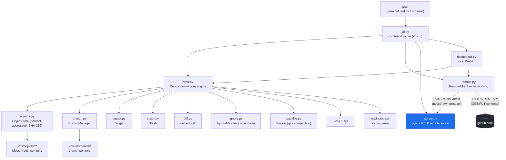

# pyvcs — Your Own Independent Version Control System

`pyvcs` is a **fully independent** version control system — not Git, but Git-**inspired**. It has its own commit object model, its own staging area, its own branch/merge/tag/stash engine, and to push to GitHub it makes direct **HTTP calls to GitHub's REST API** — the `git` binary is never called anywhere. Whether Git is installed on the system or not, `pyvcs` works exactly the same.

---

## Contents

1. [How it works (Architecture)](#1-how-it-works-architecture)
2. [Install / Run](#2-install--run)
3. [Full Command Reference](#3-full-command-reference)
4. [Pushing to GitHub (without Git)](#4-pushing-to-github-without-git)
5. [Adding a New Command](#5-adding-a-new-command)
6. [Code Editor (VS Code) Integration](#6-code-editor-vs-code-integration)
7. [Web Dashboard (Git-like UI)](#7-web-dashboard-git-like-ui)
8. [Limitations — the honest list](#8-limitations--the-honest-list)

---

## 1. How it works (Architecture)



**Layers:**

| Layer | File(s) | Responsibility |
|---|---|---|
| **CLI Router** | `cli.py` | Parses `vcs <command>` from the terminal and calls the right function |
| **Core Engine** | `repo.py` | Staging, commit, status, log, diff, blame, revert, gc — all orchestrated from here |
| **Object Store** | `objects.py` | Turns every file/tree/commit into a content-addressed object (SHA-256), zlib-compressed, stored in `.vcs/objects/` (same idea as Git's object model, entirely original implementation) |
| **Branching** | `branch.py` | Create / switch / delete / merge (fast-forward + 3-way) |
| **Tags** | `tagger.py` | Named pointers to commits |
| **Stash** | `stash.py` | Temporarily shelving uncommitted changes |
| **Ignore rules** | `ignore.py` | Reads the `.vcsignore` file — which files to never track |
| **Packfile / GC** | `packfile.py` | Combines loose objects into a compact packfile |
| **Networking** | `remote.py` | Can push in two places: (a) your own `pyvcs` server, (b) directly to GitHub (via REST API) |
| **pyvcs Server** | `server.py` | Your own lightweight remote-hosting server (think of it as a mini "self-hosted GitHub") |
| **Dashboard** | `dashboard.py` | Browser-based UI — status/log/branches/push all in one place |

Built entirely on the Python standard library — no external dependency to install.

---

## 2. Install / Run

No external packages required (Python 3.8+ is all you need). This folder also ships with a one-click installer, so anyone — anywhere in the world — can install `vcs` with a single command, with no manual path setup or alias-writing needed.

### Easiest way — one-click installer

**Windows**: double-click `install.bat` inside the `vcs` folder (or run it from a terminal).
**macOS / Linux**: in a terminal:
```bash
cd path/to/pyvcs/vcs
bash install.sh
```

Both installers **automatically detect their own folder's location** — meaning no matter where the folder is placed (Desktop, D: drive, USB stick, any machine), the installer will wire up the `vcs` command correctly. After running the installer, open a **new terminal window**, and just type:
```bash
vcs init
vcs stage .
vcs save -m "first commit"
```

> These installer scripts will work identically on someone else's computer too — there's no hardcoded username or path inside them.

### Manual way (without the installer)

```bash
# 1. Go to your project folder
cd path/to/your-project

# 2. Copy the pyvcs files there (or keep them on your PYTHONPATH)
#    assuming your pyvcs source is at ~/pyvcs/vcs:

python3 ~/pyvcs/vcs/cli.py init .
```

To avoid typing the full path every time, create a small shortcut:

**Linux / macOS** (in `~/.bashrc` or `~/.zshrc`):
```bash
alias vcs="python3 ~/pyvcs/vcs/cli.py"
```

**Windows (PowerShell profile)**:
```powershell
function vcs { python "$HOME\pyvcs\vcs\cli.py" @args }
```

Now you can type from anywhere:
```bash
vcs init
vcs stage .
vcs save -m "first commit"
vcs log
```

> If you prefer, you can also run `pip install -e .` (using the `setup.py` already included) to make `vcs` available system-wide — but the alias above is the simplest, zero-dependency approach.

---

## 3. Full Command Reference

| Command | What it does |
|---|---|
| `vcs init [dir]` | Creates a new repository (creates a `.vcs/` folder) |
| `vcs stage <file\|dir\|.>` | Adds file(s) to the staging area |
| `vcs unstage <file>` | Removes from staging |
| `vcs save -m "msg"` | Creates a commit (snapshot) from staged files |
| `vcs status` | Shows staged / modified / untracked files |
| `vcs log` | Commit history |
| `vcs show <commit\|tag>` | Full detail of a commit |
| `vcs diff [<commit\|tag>]` | Diff of working directory vs HEAD (or a given commit) |
| `vcs blame <file>` | Line-by-line, which commit wrote what |
| `vcs branch` / `vcs branch <name>` / `vcs branch -d <name>` | List / create / delete a branch |
| `vcs switch <name>` / `vcs switch -c <name>` | Switch branches (with optional create) |
| `vcs merge <branch>` | Merges a branch into the current branch |
| `vcs revert <file>` | Discards local changes to a file, restoring from HEAD |
| `vcs restore <commit\|tag>` | Restores the entire project to an earlier snapshot |
| `vcs undo` | Undoes the last commit (changes remain staged) |
| `vcs stash` / `vcs stash pop` | Shelve / re-apply changes |
| `vcs gc` | Compacts loose objects into a packfile |
| `vcs tag` / `vcs tag <name> "msg"` / `vcs tag -d <name>` | List / create / delete a tag |
| `vcs remote add <name> <url>` | Adds a pyvcs server remote |
| `vcs push` / `vcs fetch` / `vcs pull` | Sync with your own pyvcs server |
| `vcs clone <url> [dir]` | Clones a repository from a pyvcs server |
| `vcs server [port]` | Runs your own pyvcs remote server (default port 5000) |
| `vcs github <repo-url> [branch]` | Pushes tracked files to GitHub (default branch: `main`) |
| `vcs dashboard [port]` | Opens the local web UI (default port 8000) |

---

## 4. Pushing to GitHub (without Git)

This is the most important part, so here it is in detail.

`vcs github` **never uses the `git` binary at all**. Instead, it calls GitHub's [Contents REST API](https://docs.github.com/en/rest/repos/contents) directly over HTTPS using `urllib` (Python standard library), and uploads/updates every tracked file from your pyvcs commit straight to GitHub.

**Only files that are part of the pyvcs HEAD commit get pushed** — a file that was never `vcs stage`d + `vcs save`d will never go to GitHub, no matter how long it sits in the folder.

### Step-by-step setup

**Step 1 — Create a repository on GitHub** (an empty one is fine), e.g. `https://github.com/username/my-project`.

**Step 2 — Create a Personal Access Token**:
1. On GitHub: Settings → Developer settings → Personal access tokens → Tokens (classic) → **Generate new token**
2. Under scopes, select only `repo`
3. Copy the token once it's generated (it won't be shown again)

**Step 3 — Set the token as an environment variable**:

Linux / macOS:
```bash
export GITHUB_TOKEN="ghp_xxxxxxxxxxxxxxxxxxxx"
```

Windows PowerShell:
```powershell
$env:GITHUB_TOKEN = "ghp_xxxxxxxxxxxxxxxxxxxx"
```

**Step 4 — Push**:
```bash
vcs stage .
vcs save -m "my changes"
vcs github https://github.com/username/my-project.git
```

That's it. For every tracked file, pyvcs sends an HTTP `PUT` request to GitHub (fetching the file's existing SHA and updating it if it already exists, or creating it fresh otherwise) — the end result is the same as `git push`, just via a different route.

> **Security note**: Never hardcode or commit the token anywhere in your code — always use it via an environment variable.

---

## 5. Adding a New Command

Every command touches two places:

1. **Logic** — the actual function, in `repo.py` (or `branch.py`/`tagger.py`/etc.)
2. **Wiring** — an `elif cmd == "...":` block in `cli.py`, plus a line in `HELP_TEXT`

### Example: `vcs clean` (deletes untracked files)

Add to **`repo.py`**:
```python
def clean(self):
    """Delete all untracked files from the working directory."""
    _, _, _, untracked = self.get_status_lists()
    for fp in untracked:
        os.remove(os.path.join(self.root_dir, fp))
        print(f"Removed {fp}")
    if not untracked:
        print("Nothing to clean.")
```

Add to **`cli.py`** (one line in the help text, and one block in the dispatcher):
```python
elif cmd == "clean":
    repo.clean()
```

Done — `vcs clean` will now work. The same pattern applies for `vcs amend`, `vcs cherry-pick`, `vcs alias`, or anything else you want to add.

---

## 6. Code Editor (VS Code) Integration

There are two levels here — both real, working integrations:

### Level 1 — Terminal / Tasks (works immediately, no coding needed)

The `vcs` alias will already work in VS Code's integrated terminal (see Section 2). One step further, you can build VS Code **Tasks** to get buttons/shortcuts:

`.vscode/tasks.json` (inside your project):
```json
{
  "version": "2.0.0",
  "tasks": [
    {
      "label": "vcs: stage all",
      "type": "shell",
      "command": "vcs stage ."
    },
    {
      "label": "vcs: save",
      "type": "shell",
      "command": "vcs save -m \"${input:commitMsg}\""
    },
    {
      "label": "vcs: push to GitHub",
      "type": "shell",
      "command": "vcs github https://github.com/username/my-project.git"
    }
  ],
  "inputs": [
    {
      "id": "commitMsg",
      "type": "promptString",
      "description": "Commit message"
    }
  ]
}
```
Now `Ctrl+Shift+P` → "Run Task" → "vcs: save" runs the command without typing it in the terminal.

### Level 2 — A Real VS Code Extension (Source Control sidebar)

For a Git-like **native sidebar UI** (staged/unstaged file list, a "+" button to stage, a commit box), you'd need to write an extension using VS Code's `SourceControl` API — this is done in TypeScript, as a completely separate codebase from `pyvcs`, and could even be published to the VS Code Marketplace. High-level structure:

```
pyvcs-vscode-extension/
├── package.json          # extension manifest, activation events
├── src/
│   └── extension.ts      # registers a SourceControl provider via the vscode.scm API
```
Inside `extension.ts`, `vscode.scm.createSourceControl(...)` registers a new SCM provider, whose resource states you'd populate from `vcs status`'s output (as JSON). This can be built as a separate, dedicated project — let me know if you'd like a skeleton for it too.

For now, **Level 1 (Tasks)** is the most practical, immediately usable approach.

---

## 7. Web Dashboard (Git-like UI)

```bash
vcs dashboard
```
This opens a local web UI at `http://localhost:8000` (the browser opens automatically), from where you get:

- **Status, Log, Branches, Tags, Diff** — all on one screen
- Buttons for: **Stage**, **Save (commit)**, **Push** (pyvcs server), **Pull**, **Fetch**
- **Push to GitHub** — enter the URL and push directly (same approach as Section 4, via the UI)

To change the port: `vcs dashboard 9000`

---

## 8. Limitations — the honest list

- `vcs github` requires internet access and a valid GitHub token — this is a GitHub API requirement, and any tool pushing to GitHub (Git or pyvcs) needs authentication.
- Every push makes a separate API call per tracked file — with a very large number of files (hundreds), this can be a bit slow for big repos. Perfectly fine for small/medium projects.
- `vcs github` currently only updates a single branch (pull requests, merge conflicts on GitHub's side, etc. aren't implemented yet).
- VS Code sidebar-level integration (Level 2 above) requires a separate extension project — not included in this repo yet.
