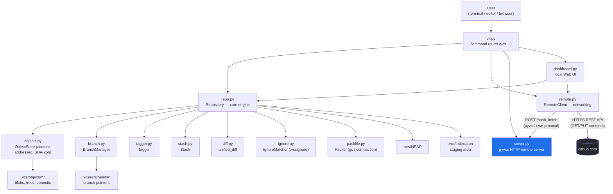

# pyvcs — apna khud ka, independent Version Control System

`pyvcs` ek **poori tarah se independent** version control system hai — Git nahi, Git **jaisa**. Iska apna commit object model hai, apna staging area hai, apna branch/merge/tag/stash engine hai, aur GitHub par push karne ke liye ye seedhe **GitHub ke REST API se HTTP call** karta hai — kisi bhi jagah `git` binary ko call nahi karta. System mein Git installed ho ya na ho, `pyvcs` bilkul kaam karega.

---

## Contents

1. [Ye kaam kaise karta hai (Architecture)](#1-ye-kaam-kaise-karta-hai-architecture)
2. [Install / Run kaise karein](#2-install--run-kaise-karein)
3. [Sab commands (reference)](#3-sab-commands-reference)
4. [GitHub par push kaise hota hai (bina Git ke)](#4-github-par-push-kaise-hota-hai-bina-git-ke)
5. [Naya command kaise add karein](#5-naya-command-kaise-add-karein)
6. [Code editor (VS Code) ke saath integration](#6-code-editor-vs-code-ke-saath-integration)
7. [Web Dashboard (git jaisi UI)](#7-web-dashboard-git-jaisi-ui)
8. [Limitations — imandaari se](#8-limitations--imandaari-se)

---

## 1. Ye kaam kaise karta hai (Architecture)



**Layers:**

| Layer | File(s) | Kaam |
|---|---|---|
| **CLI Router** | `cli.py` | Terminal se `vcs <command>` parse karke sahi function call karta hai |
| **Core Engine** | `repo.py` | Staging, commit, status, log, diff, blame, revert, gc — sab yahin se orchestrate hota hai |
| **Object Store** | `objects.py` | Har file/tree/commit ko SHA-256 se content-addressed object bana ke `.vcs/objects/` mein zlib-compressed store karta hai (Git ke object model jaisa hi idea, apna implementation) |
| **Branching** | `branch.py` | Create / switch / delete / merge (fast-forward + 3-way) |
| **Tags** | `tagger.py` | Named pointers to commits |
| **Stash** | `stash.py` | Uncommitted changes ko temporarily shelve karna |
| **Ignore rules** | `ignore.py` | `.vcsignore` file padhta hai — kis file ko track nahi karna |
| **Packfile / GC** | `packfile.py` | Loose objects ko compact packfile mein combine karta hai |
| **Networking** | `remote.py` | Do jagah push kar sakta hai: (a) apna `pyvcs` server (b) seedha GitHub (REST API se) |
| **pyvcs Server** | `server.py` | Tumhara apna lightweight remote-hosting server (jaise ek mini "self-hosted GitHub") |
| **Dashboard** | `dashboard.py` | Browser-based UI — status/log/branches/push sab ek jagah |

Sab kuch pure Python standard library se bana hai — koi external dependency install nahi karni.

---

## 2. Install / Run kaise karein

Kisi bhi external package ki zaroorat nahi (Python 3.8+ bas kaafi hai). Ab is folder mein ek-click installer bhi diya hai, taaki koi bhi (chahe world mein kahin bhi ho) sirf ek command chala ke `vcs` use kar sake — kisi bhi tarah ka manual path setup ya alias likhna nahi padta.

### Sabse aasan tareeka — one-click installer

**Windows**: `vcs` folder ke andar `install.bat` par double-click karo (ya terminal se `install.bat` chalao).
**macOS / Linux**: terminal mein:
```bash
cd path/to/pyvcs/vcs
bash install.sh
```

Dono installer **is folder ka apna hi path detect kar lete hain** — yaani folder chahe kahin bhi rakha ho (Desktop, D: drive, USB, kisi bhi machine par), installer khud sahi jagah `vcs` command ko point kar dega. Installer chalne ke baad ek **naya terminal window** kholo, aur seedha likho:
```bash
vcs init
vcs stage .
vcs save -m "first commit"
```

> Ye installer scripts ek dusre computer par bhi bilkul waise hi kaam karenge — kisi ke naam ya path ka koi hardcoding nahi hai andar.

### Manual tareeka (bina installer ke)

```bash
# 1. Apne project folder mein jaao
cd path/to/tumhara-project

# 2. pyvcs ki files ko wahan copy karo (ya PYTHONPATH mein rakho)
#    maan lo pyvcs ka source tumhare paas ~/pyvcs/vcs mein hai:

python3 ~/pyvcs/vcs/cli.py init .
```

Roz-roz `python3 ~/pyvcs/vcs/cli.py ...` likhna avoid karne ke liye, ek chhota shortcut bana lo:

**Linux / macOS** (`~/.bashrc` ya `~/.zshrc` mein):
```bash
alias vcs="python3 ~/pyvcs/vcs/cli.py"
```

**Windows (PowerShell profile)**:
```powershell
function vcs { python "$HOME\pyvcs\vcs\cli.py" @args }
```

Ab tum kahin se bhi seedha likh sakte ho:
```bash
vcs init
vcs stage .
vcs save -m "first commit"
vcs log
```

> Chaho toh `setup.py` (already isme diya hua hai) use karke `pip install -e .` bhi kar sakte ho, taaki `vcs` command system-wide ban jaaye — lekin upar wala alias sabse simple aur zero-dependency tareeka hai.

---

## 3. Sab commands (reference)

| Command | Kaam |
|---|---|
| `vcs init [dir]` | Naya repository banata hai (`.vcs/` folder create hota hai) |
| `vcs stage <file\|dir\|.>` | File(s) ko staging area mein daalta hai |
| `vcs unstage <file>` | Staging se hataata hai |
| `vcs save -m "msg"` | Staged files ka commit (snapshot) banata hai |
| `vcs status` | Staged / modified / untracked files dikhata hai |
| `vcs log` | Commit history |
| `vcs show <commit\|tag>` | Ek commit ki poori detail |
| `vcs diff [<commit\|tag>]` | Working directory vs HEAD (ya diya gaya commit) ka diff |
| `vcs blame <file>` | Line-by-line kis commit ne kya likha |
| `vcs branch` / `vcs branch <name>` / `vcs branch -d <name>` | List / create / delete branch |
| `vcs switch <name>` / `vcs switch -c <name>` | Branch switch karna (with optional create) |
| `vcs merge <branch>` | Branch ko current branch mein merge karna |
| `vcs revert <file>` | Ek file ke local changes discard karke HEAD se restore |
| `vcs restore <commit\|tag>` | Poora project kisi purani snapshot pe le jaana |
| `vcs undo` | Last commit undo (changes staged rehte hain) |
| `vcs stash` / `vcs stash pop` | Changes shelve / re-apply |
| `vcs gc` | Loose objects ko packfile mein compact karna |
| `vcs tag` / `vcs tag <name> "msg"` / `vcs tag -d <name>` | List / create / delete tag |
| `vcs remote add <name> <url>` | pyvcs server ka remote add karna |
| `vcs push` / `vcs fetch` / `vcs pull` | pyvcs ke apne server ke saath sync |
| `vcs clone <url> [dir]` | pyvcs server se repository clone karna |
| `vcs server [port]` | Apna pyvcs remote server chalu karna (default port 5000) |
| `vcs github <repo-url> [branch]` | Tracked files GitHub par push karna (default branch: `main`) |
| `vcs dashboard [port]` | Local web UI kholna (default port 8000) |

---

## 4. GitHub par push kaise hota hai (bina Git ke)

Ye sabse important part hai, isliye detail mein.

`vcs github` **`git` binary bilkul use nahi karta**. Iske bajaye ye seedha GitHub ke [Contents REST API](https://docs.github.com/en/rest/repos/contents) ko `urllib` (Python standard library) se HTTPS call karta hai, aur tumhare pyvcs commit se har tracked file ko GitHub par upload/update kar deta hai.

**Ye sirf unhi files ko push karta hai jo pyvcs ke HEAD commit mein hain** — jo file kabhi `vcs stage` + `vcs save` nahi hui, wo folder mein pade rehne ke bawajood kabhi GitHub par nahi jaayegi.

### Step-by-step setup

**Step 1 — GitHub par ek repository bana lo** (empty bhi chalega), jaise `https://github.com/username/my-project`.

**Step 2 — Personal Access Token banao**:
1. GitHub par: Settings → Developer settings → Personal access tokens → Tokens (classic) → **Generate new token**
2. Scope mein sirf `repo` select karo
3. Token generate hone ke baad copy kar lo (dobara nahi dikhega)

**Step 3 — Token ko environment variable mein set karo**:

Linux / macOS:
```bash
export GITHUB_TOKEN="ghp_xxxxxxxxxxxxxxxxxxxx"
```

Windows PowerShell:
```powershell
$env:GITHUB_TOKEN = "ghp_xxxxxxxxxxxxxxxxxxxx"
```

**Step 4 — Push karo**:
```bash
vcs stage .
vcs save -m "my changes"
vcs github https://github.com/username/my-project.git
```

Bas. Har tracked file ke liye pyvcs GitHub ko ek HTTP `PUT` request bhejta hai (agar file already exist karti hai to uska SHA fetch karke update karta hai, warna naya file create karta hai) — end result Git ke `git push` jaisa hi hota hai, sirf raaste alag hain.

> **Security note**: Token ko kabhi bhi code mein hardcode ya commit mat karna — hamesha environment variable se hi use karo.

---

## 5. Naya command kaise add karein

Har command do jagah touch karta hai:

1. **Logic** — `repo.py` (ya `branch.py`/`tagger.py`/etc.) mein actual function
2. **Wiring** — `cli.py` mein `elif cmd == "...":` block + `HELP_TEXT` mein ek line

### Example: `vcs clean` (untracked files delete karne ke liye)

**`repo.py`** mein add karo:
```python
def clean(self):
    """Delete all untracked files from the working directory."""
    _, _, _, untracked = self.get_status_lists()
    for fp in untracked:
        os.remove(os.path.join(self.root_dir, fp))
        print(f"Removed {fp}")
    if not untracked:
        print("Nothing to clean.")
```

**`cli.py`** mein add karo (help text mein ek line, aur dispatch mein ek block):
```python
elif cmd == "clean":
    repo.clean()
```

Bas — `vcs clean` ab kaam karega. Isi pattern se `vcs amend`, `vcs cherry-pick`, `vcs alias`, jo bhi chaho, add ho sakta hai.

---

## 6. Code editor (VS Code) ke saath integration

Do level hote hain — dono hi asli, kaam karne wale integration hain:

### Level 1 — Terminal / Tasks (turant use ho sakta hai, koi coding nahi chahiye)

VS Code ke integrated terminal mein `vcs` alias already kaam karega (Section 2 dekho). Isse ek kadam aage, VS Code **Tasks** bana ke buttons/shortcuts bhi bana sakte ho:

`.vscode/tasks.json` (apne project ke andar):
```json
{
  "version": "2.0.0",
  "tasks": [
    {
      "label": "vcs: stage all",
      "type": "shell",
      "command": "vcs stage ."
    },
    {
      "label": "vcs: save",
      "type": "shell",
      "command": "vcs save -m \"${input:commitMsg}\""
    },
    {
      "label": "vcs: push to GitHub",
      "type": "shell",
      "command": "vcs github https://github.com/username/my-project.git"
    }
  ],
  "inputs": [
    {
      "id": "commitMsg",
      "type": "promptString",
      "description": "Commit message"
    }
  ]
}
```
Ab `Ctrl+Shift+P` → "Run Task" → "vcs: save" jaisa kuch karke, bina terminal mein type kiye command chalegi.

### Level 2 — Asli VS Code Extension (Source Control sidebar jaisa)

Git jaise **native sidebar UI** (jahan staged/unstaged files list dikhein, "+" button se stage ho, commit box ho) ke liye VS Code ki `SourceControl` API use karke ek extension likhni padegi — ye TypeScript mein hota hai, alag project hai (`pyvcs` se bilkul independent codebase), aur VS Code Marketplace pe publish bhi ho sakta hai. High level structure:

```
pyvcs-vscode-extension/
├── package.json          # extension manifest, activation events
├── src/
│   └── extension.ts      # vscode.scm API se SourceControl provider register karna
```
`extension.ts` ke andar `vscode.scm.createSourceControl(...)` se ek naya SCM provider register hota hai, jiske resource states tumhare `vcs status` ke output se (JSON ke form mein) bharoge. Agar tum chaho, ye ek alag, dedicated project ke roop mein bana sakte hain — batana, main uska skeleton bhi bana ke de sakta hoon.

Abhi ke liye **Level 1 (Tasks)** sabse practical aur turant kaam karne wala tareeka hai.

---

## 7. Web Dashboard (git jaisi UI)

```bash
vcs dashboard
```
Ye `http://localhost:8000` par ek local web UI khol deta hai (browser khud khul jaata hai) jahan se:

- **Status, Log, Branches, Tags, Diff** — sab ek screen par
- Buttons se: **Stage**, **Save (commit)**, **Push** (pyvcs server), **Pull**, **Fetch**
- **Push to GitHub** — URL daal ke seedha GitHub push (Section 4 wala hi tareeka, UI se)

Port change karna ho: `vcs dashboard 9000`

---

## 8. Limitations — imandaari se

- `vcs github` ke liye internet aur ek valid GitHub token chahiye hi hoga (ye GitHub ki API ki requirement hai, koi bhi tool jo GitHub par push kare — Git ho ya pyvcs — usko authentication chahiye hoga).
- Har push par har tracked file ke liye ek alag API call hoti hai — bahut zyada files (jaise sainkdo) ho to thoda slow lagega bade repos ke liye. Chhote/medium projects ke liye bilkul theek hai.
- `vcs github` filhaal sirf ek branch ko update karta hai (pull requests, merge conflicts on GitHub side, etc. abhi implement nahi hain).
- VS Code sidebar-level integration (Level 2 upar) ek separate extension project maangta hai — abhi repo mein included nahi hai.
